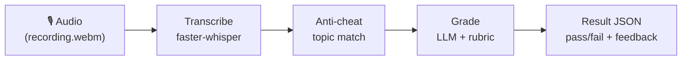
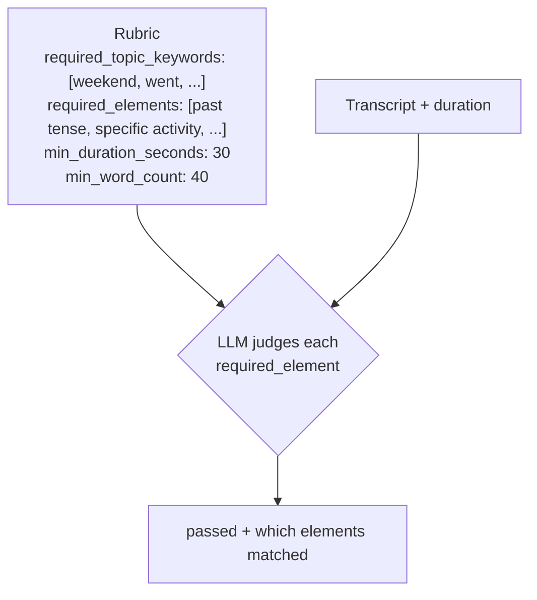
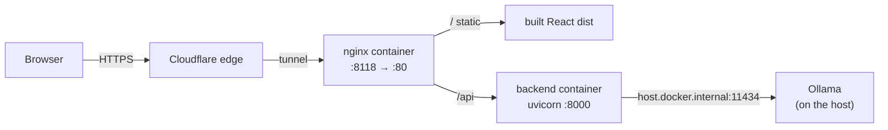
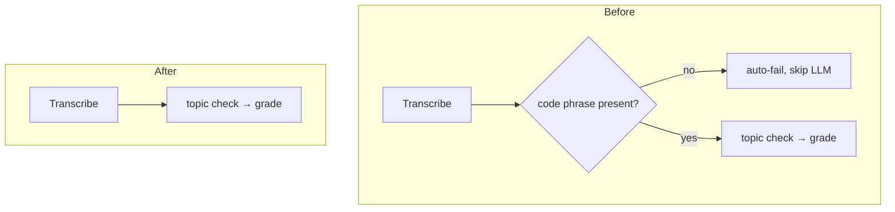
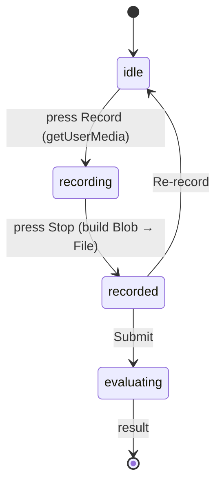

# TalkQuest Deep Dive

TalkQuest is a daily English-speaking app: you get one challenge, record yourself speaking, and an
AI grades the recording against an explicit rubric and hands back pass/fail plus one thing you did
well and one thing to improve. This note walks through the whole system — what it is, the shape of
the code, and the four notable changes made this session that took it from a local prototype to a
self-hosted, browser-native app running live at **https://talkquest.bhgroup.uz**. Related vault
notes: [[functional-spec]], [[deployment]], [[decisions]].

**Contents**
- [[#Background]]
- [[#Intuition]]
- [[#Code walkthrough]]
- [[#What changed this session]]
- [[#Quiz]]

---

## Background

> [!note] Skip ahead if you're already comfortable with FastAPI, Whisper, and containers.
> The first part of this section is a from-scratch primer; the TalkQuest-specific background starts
> at **"The pipeline"** below.

### For newcomers: the moving parts

Four ideas underpin everything here.

**A web API.** The backend is a [FastAPI](https://fastapi.tiangolo.com/) app — a Python program that
listens for HTTP requests and answers them with JSON. When your browser asks
`GET /api/challenge/today`, a Python function runs and returns today's challenge as JSON.

**Speech-to-text (STT).** To grade speaking, we first turn audio into text. TalkQuest uses
[faster-whisper](https://github.com/SYSTRAN/faster-whisper), a fast reimplementation of OpenAI's
Whisper model that runs *locally* on the CPU — no cloud API. Give it an audio file, get back a
transcript.

**A large language model (LLM) as a grader.** Deciding whether someone "described their weekend in
past tense" is fuzzy — exactly the kind of judgment LLMs are good at. We hand the LLM the transcript
plus a rubric and ask it to return a strict verdict. The trick is forcing **structured output** (a
fixed JSON shape) so the answer is machine-readable, never a free-form paragraph.

**Containers.** Whisper needs `ffmpeg`; the frontend needs Node to build and nginx to serve. Rather
than install all that on a server by hand, we describe each service in a `Dockerfile` and wire them
together with `docker compose`, so the whole app starts with one command.

> [!info] The self-hosting theme
> A design thread runs through the whole project: **everything runs on our own machine.** STT is
> local (faster-whisper), grading is local (Ollama, see below), and hosting is a shared school box.
> There are no per-request API bills and no external keys to leak.

### The pipeline

Every submission flows through the same four stages. This is the diagram to keep in your head — the
rest of the note is really just "what each box does" and "how each box changed."



With toy data, a single request looks like this:

| Stage | Value |
|---|---|
| Audio in | `recording.webm` (24s, "Last weekend I went hiking…") |
| Transcript | `"Last weekend I went hiking with my friends…"` + `duration = 24.1s` |
| Anti-cheat | `topic_ok = true` (contains "weekend", "went") |
| Grade | `{ passed: false, matched_elements: [...], feedback: {...} }` |
| Result out | `passed:false` (24s < 30s min), plus a strength + an improvement |

---

## Intuition

The single most important idea in TalkQuest is: **"completed" is a checklist, not a vibe.** A
challenge isn't graded on general impression; it's graded against a `rubric` object with concrete,
checkable fields.



Because the rubric is explicit, two things follow. First, the cheap checks (does the transcript even
mention the topic?) can run in plain Python before we ever call the model. Second, the LLM's answer
can be constrained to a fixed schema — we're not asking "how did they do?", we're asking "fill in
this form."

> [!tip] Cheap-first ordering
> Checks are ordered cheapest-to-most-expensive. A pure-Python keyword scan costs microseconds; an
> LLM call costs seconds. Run the cheap one first so an obviously off-topic recording can be flagged
> without spending model time. (This session simplified *which* cheap checks exist — see below — but
> the principle stayed.)

The second big idea is **honest self-hosting has consequences you must design around.** A local
Whisper model has to load into memory on first use (slow), and a locally-hosted LLM lives in a
*different container* than the backend. Both facts shaped concrete decisions in the code: a cache
volume so the model download survives restarts, and a special hostname so one container can reach a
service on the host. Hold those two facts; they explain otherwise-mysterious config lines.

---

## Code walkthrough

The repo has three parts: a Python backend, a React frontend, and an Obsidian docs vault (the notes
you're reading).

```
backend/app/     FastAPI + pipeline
frontend/src/    React (Vite) SPA
docs/            this vault
docker-compose.yml, deploy.sh, */Dockerfile   deployment
```

### The backend pipeline

`backend/app/main.py` is the spine — it wires the four stages together:

```python
# POST /api/submit  (simplified)
transcript, duration = transcribe.transcribe(tmp_path)   # 1. STT
checks  = anticheat.run_checks(transcript, challenge)     # 2. cheap check (topic)
result  = evaluate.evaluate(transcript, challenge, duration)  # 3. LLM grade
return SubmitResponse(
    passed=result.passed and checks.topic_ok,             # 4. combine
    transcript=transcript, checks=checks,
    matched_elements=result.matched_elements, feedback=result.feedback,
)
```

Each stage is its own small module:

- **`transcribe.py`** — wraps faster-whisper. The model is built lazily and memoized with
  `@lru_cache(maxsize=1)`, so it loads once and is reused across requests. Returns
  `(transcript_text, duration_seconds)`.
- **`anticheat.py`** — the topic-match check: does the transcript contain any
  `required_topic_keywords`? Pure Python, no dependencies.
- **`evaluate.py`** — the grader. Builds a prompt from the rubric + transcript and calls the LLM,
  forcing the reply into the `EvalResult` schema.
- **`challenges.py`** — one hardcoded challenge for the MVP (daily rotation is deferred).
- **`schemas.py`** — the Pydantic models that define every shape: `Rubric`, `Challenge`,
  `ChallengePublic` (the safe subset the client sees — rubric internals stay server-side), `Checks`,
  `Feedback`, `EvalResult`, `SubmitResponse`.

> [!example] Why `ChallengePublic` exists
> The full `Challenge` contains the rubric — the answer key. If we returned it to the browser, a
> user could read exactly which keywords/elements the grader wants. `ChallengePublic.from_challenge()`
> copies only the safe fields (topic, instructions), leaving the rubric on the server.

### The frontend

A small Vite + React single-page app in `frontend/src/`:

- **`api.js`** — two thin `fetch` wrappers hitting relative `/api/...` paths.
- **`App.jsx`** — the whole UI: shows the challenge, captures a recording, submits it, and renders
  the result. This file did the most changing this session.

Because `api.js` calls *relative* paths (`/api/submit`, not `http://host/api/submit`), the app must
be served **same-origin** with the API. In dev, Vite's proxy handles that; in prod, nginx does. Keep
this in mind — it's why the deployment has an nginx layer at all.

### Deployment topology



The `web` (nginx) container serves the built frontend and reverse-proxies `/api` to the `backend`
container — that's what makes the relative paths work. Cloudflare Tunnel terminates TLS at its edge
and forwards `talkquest.bhgroup.uz` to `localhost:8118`, so the firewalled school box needs no open
inbound ports. See [[deployment]] for the full runbook.

---

## What changed this session

Four changes, each its own commit, moved TalkQuest from "runs on my laptop" to "live and
self-hosted."

### 1. Containerized deployment (`0139fbf`)

Added `backend/Dockerfile` (python + ffmpeg), a multi-stage `frontend/Dockerfile` (Node builds →
nginx serves), `frontend/nginx.conf`, and a root `docker-compose.yml` tying them together on port
`8118`. Two details worth calling out:

> [!warning] Two easy-to-miss nginx settings
> `frontend/nginx.conf` sets `client_max_body_size 50m` (audio uploads exceed nginx's 1 MB default)
> and `proxy_read_timeout 300s` (the transcribe-then-grade round-trip can take tens of seconds; the
> 60 s default would cut it off). Omit either and the app "mysteriously" fails on real recordings.

### 2. Claude → self-hosted Ollama (`051635b`)

`evaluate.py` was rewritten to call a local [Ollama](https://ollama.com/) model instead of Anthropic's
API. Same prompt, same strict-JSON contract — only the transport changed:

```python
response = Client(host=OLLAMA_HOST).chat(
    model=MODEL,                                   # e.g. qwen2.5:7b-instruct
    messages=[{"role": "system", ...}, {"role": "user", ...}],
    format=EvalResult.model_json_schema(),         # force the JSON shape
    options={"temperature": 0},
)
return EvalResult.model_validate_json(response["message"]["content"])
```

The `format=...schema` line is the whole game: Ollama constrains the model's output to match the
Pydantic schema, so `model_validate_json` always parses. This removed the last external API key —
the pipeline is now fully local.

> [!note] The `host.docker.internal` puzzle
> Ollama runs on the **host**, but the backend runs in a **container**, where `localhost` means the
> container itself. So `docker-compose.yml` sets `OLLAMA_HOST=http://host.docker.internal:11434` and
> adds `extra_hosts: ["host.docker.internal:host-gateway"]` — the magic that lets a container dial a
> service on its host.

### 3. Solo-speaking task + code-phrase removal (`634f538`)

Originally the task was "have a Discord conversation and say a secret code word (`lantern`) so we
know the recording is fresh." This session simplified it to a **solo speaking** exercise and deleted
the code-phrase machinery entirely — from `schemas.py`, `anticheat.py`, `main.py`, `challenges.py`,
and the UI.



The frontend also stopped hiding the transcript behind a toggle (it's shown inline now) and the
result dropped the "code phrase" badge, keeping only "on topic."

> [!info] A spec deviation, logged not hidden
> The code phrase was functional-spec §5.1's "primary defense," and solo-speaking deviates from
> §1/§10. Per the working agreement, both are recorded in [[decisions]] and flagged inline in
> [[functional-spec]] rather than silently changed.

### 4. In-browser recording (`d907be9`)

The biggest UI change: instead of uploading a file, you press **Record**, and the browser's
`MediaRecorder` captures mic audio directly. `App.jsx` gained a small state machine:



The recorded audio is wrapped in a named `File` (`recording.webm`), so the existing `submitAudio`
works unchanged and the backend's ffmpeg decodes the browser's WebM/Opus without any change. File
upload stays as a fallback for when the mic is blocked.

The evaluation wait also got an **estimated** progress bar + "~Ns left", derived from the clip
length (`clamp(round(8 + 0.8 * audioSeconds), 12, 90)`), degrading to "Finishing up…" on overrun —
honest, because the true server time isn't knowable in advance.

> [!tip] The stale-closure bug that got caught in review
> `MediaRecorder.onstop` is a closure created when recording *starts*, so it captured `recSeconds`
> as `0`. The fix mirrors the live value into a ref (`recSecondsRef`) that `onstop` reads, so the
> duration estimate is correct. A classic React gotcha worth remembering.

---

## Quiz

Test yourself — each answer is hidden until you expand it.

**1. Why does the frontend call relative paths like `/api/submit` instead of an absolute URL, and what does that force the deployment to provide?**
- A) It's shorter to type; nothing downstream depends on it.
- B) So the app can be served same-origin — which is why nginx must reverse-proxy `/api` to the backend.
- C) Because React forbids absolute URLs in `fetch`.
- D) So Cloudflare can cache the API responses.

> [!success]- Show answer
> **Correct: B.** Relative paths resolve against whatever origin serves the page, so the API must
> live at the same origin — nginx serves the static build *and* proxies `/api` to the backend.
> - A) ❌ It has a real architectural consequence (same-origin serving).
> - C) ❌ React/`fetch` allow absolute URLs fine.
> - D) ❌ Caching isn't the reason; POST `/api/submit` isn't cacheable anyway.

**2. When migrating from Claude to Ollama, what makes the response reliably parseable into `EvalResult`?**
- A) `temperature: 0` alone guarantees valid JSON.
- B) Passing `format=EvalResult.model_json_schema()`, which constrains Ollama's output to the schema.
- C) A regex that extracts JSON from the model's prose.
- D) Retrying the call until it happens to return JSON.

> [!success]- Show answer
> **Correct: B.** Ollama's `format` parameter takes a JSON Schema and constrains generation to match
> it, so `model_validate_json` parses every time.
> - A) ❌ Temperature 0 makes output deterministic, not schema-valid.
> - C) ❌ No regex extraction is used (and would be brittle).
> - D) ❌ There's no retry loop; the constraint makes one unnecessary.

**3. The backend container sets `OLLAMA_HOST=http://host.docker.internal:11434` and adds `extra_hosts: ["host.docker.internal:host-gateway"]`. Why not just use `localhost:11434`?**
- A) Port 11434 is blocked on localhost.
- B) Inside a container, `localhost` is the container itself, not the host where Ollama runs.
- C) Ollama only accepts connections over `host.docker.internal`.
- D) It's required for HTTPS.

> [!success]- Show answer
> **Correct: B.** A container's `localhost` is its own network namespace. `host.docker.internal`
> (mapped to `host-gateway`) resolves to the host, letting the container reach the host's Ollama.
> - A) ❌ The port isn't blocked; the address space is the issue.
> - C) ❌ Ollama listens on `0.0.0.0:11434`; the hostname is a client-side concern.
> - D) ❌ Nothing here involves TLS.

**4. After removing the code phrase, what is the *only* remaining cheap anti-cheat check, and where does its result feed into the final verdict?**
- A) Duration check; it's returned directly as `passed`.
- B) Topic match (`topic_ok`); it's AND-ed with the LLM's `passed` in the final result.
- C) Voice fingerprinting; it short-circuits before the LLM.
- D) Code-phrase check; it still runs silently.

> [!success]- Show answer
> **Correct: B.** `run_checks` now returns only `topic_ok`, and `main.py` computes
> `passed = result.passed and checks.topic_ok`.
> - A) ❌ Duration is part of the rubric the LLM weighs, not a separate boolean gate.
> - C) ❌ Voice fingerprinting is a deferred, unimplemented layer.
> - D) ❌ The code-phrase check was deleted entirely, not hidden.

**5. Why is the "time left" during evaluation an *estimate* that can fall back to "Finishing up…", rather than a precise countdown?**
- A) JavaScript timers aren't accurate enough for a real countdown.
- B) The server doesn't stream progress, and true processing time depends on clip length and whether the model is warm — so it can't be known up front.
- C) Cloudflare hides the real timing from the client.
- D) The backend deliberately randomizes response time.

> [!success]- Show answer
> **Correct: B.** Processing time varies with audio length and model warmth (a cold Whisper load is
> much slower), and there's no progress stream, so the client can only estimate — and must degrade
> gracefully when it overruns.
> - A) ❌ Timer precision is fine; the unknown is server duration.
> - C) ❌ Cloudflare just forwards the request; it isn't withholding timing.
> - D) ❌ Nothing randomizes timing on purpose.

---

## Related

- [[README]] · [[functional-spec]] · [[deployment]] · [[decisions]] · [[progress]]
