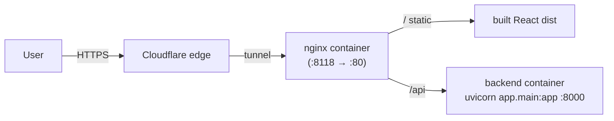

# Deployment

How TalkQuest runs in production on the school Docker host, and how CI/CD keeps it updated.

## Where it runs

The school box (`school`, Ubuntu 24.04, user `bhgroup`) is a shared multi-project Docker host.
TalkQuest follows the box's convention: it lives in `~/dev/TalkQuest/` with its own
`docker-compose.yml`, exposed on a unique host port (**8118**).

## Architecture



- **web** (`talkquest_web`) — multi-stage image: Node builds the Vite frontend, nginx serves the
  static `dist/` and reverse-proxies `/api` → `backend:8000`. Published as `8118:80`.
  Config: `frontend/nginx.conf` (raises `client_max_body_size` for audio uploads and proxy
  timeouts for the slow transcribe + Claude pipeline).
- **backend** (`talkquest_backend`) — FastAPI/uvicorn. Internal only (no host port). Fully
  self-hosted: transcription via faster-whisper **on the GPU** (`WHISPER_DEVICE=cuda`,
  `float16`; the container gets the GPU via a `deploy.resources` device reservation, and the
  image ships the CUDA libs `nvidia-cublas-cu12` + `nvidia-cudnn-cu12`), grading via the host's
  **Ollama** (`OLLAMA_HOST=http://host.docker.internal:11434`, model in `OLLAMA_MODEL`).
  **No API key needed.** The downloaded Whisper model is cached in the `whisper_cache` named volume
  so it survives rebuilds (`HF_HOME=/models`). VRAM budget: `small`/`medium` Whisper fits alongside
  the 7B grader on the 8 GB RTX 5060; `large-v3` + the 7B would not.

## Public access

Public HTTPS is served by **Cloudflare Tunnel** (`/etc/cloudflared/config.yaml`) — there is no host
nginx. An ingress route maps `talkquest.bhgroup.uz` → `http://localhost:8118`; TLS is terminated at
Cloudflare's edge.

## Deploy (manual)

GitHub-hosted Actions are unavailable (account billing), and the box is campus-only / firewalled
(no inbound webhooks), so deploys are **manual** via a script on the box: `deploy.sh`.

After pushing to `main`, redeploy with:

```bash
ssh school "~/dev/TalkQuest/deploy.sh"
```

`deploy.sh` does: `git fetch` + `git reset --hard origin/main` → `docker compose build`
(a failed build stops here, leaving the running stack untouched) → `docker compose up -d`
→ `docker image prune -f`.

If automation is wanted later, the firewall-friendly options are a cron/systemd-timer poll on the
box, or a self-hosted GitHub Actions runner (free, not subject to hosted-runner spending limits).

## One-time server setup

1. `git clone <repo> ~/dev/TalkQuest`
2. Pull a grading model in Ollama and (optionally) set it: `ollama pull qwen2.5:7b-instruct`,
   then `echo 'OLLAMA_MODEL=qwen2.5:7b-instruct' > ~/dev/TalkQuest/.env`. No secrets/API keys needed.
3. Install the self-hosted runner in `~/actions-runner` (`./config.sh --url .../TalkQuest
   --token <REG_TOKEN> --labels talkquest`), then `sudo ./svc.sh install bhgroup && sudo ./svc.sh start`.
4. Add the Cloudflare ingress route for `talkquest.bhgroup.uz` → `http://localhost:8118` in
   `/etc/cloudflared/config.yaml` (above the `http_status:404` catch-all), add the DNS route
   (`cloudflared tunnel route dns f33924fe-… talkquest.bhgroup.uz`), and
   `sudo systemctl restart cloudflared`. **Note:** the `school` SSH host tunnels through cloudflared,
   so restarting it drops your SSH session momentarily — it reconnects once the service is back.
5. First deploy: `cd ~/dev/TalkQuest && docker compose up -d --build`. Thereafter use `deploy.sh`.

This setup is already live at **https://talkquest.bhgroup.uz** (deployed 2026-07-14).

## Related

- [[README]] · [[progress]] · [[decisions]] · [[functional-spec]]
