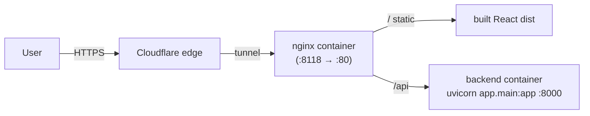

# Deployment

How TalkQuest runs in production on the school Docker host, and how CI/CD keeps it updated.

## Where it runs

The school box (`school`, Ubuntu 24.04, user `bhgroup`) is a shared multi-project Docker host.
TalkQuest follows the box's convention: it lives in `~/dev/TalkQuest/` with its own
`docker-compose.yml`, exposed on a unique host port (**8118**).

## Architecture

- **web** (`talkquest_web`) — multi-stage image: Node builds the Vite frontend, nginx serves the
  static `dist/` and reverse-proxies `/api` → `backend:8000`. Published as `8118:80`.
  Config: `frontend/nginx.conf` (raises `client_max_body_size` for audio uploads and proxy
  timeouts for the slow transcribe + Claude pipeline).
- **backend** (`talkquest_backend`) — FastAPI/uvicorn. Internal only (no host port). Fully
  self-hosted: transcription via faster-whisper, grading via the host's **Ollama**
  (`OLLAMA_HOST=http://host.docker.internal:11434`, model in `OLLAMA_MODEL`). **No API key needed.**
  The downloaded Whisper model is cached in the `whisper_cache` named volume so it survives
  rebuilds (`HF_HOME=/models`).

## Public access

Public HTTPS is served by **Cloudflare Tunnel** (`/etc/cloudflared/config.yaml`) — there is no host
nginx. An ingress route maps `talkquest.bhgroup.uz` → `http://localhost:8118`; TLS is terminated at
Cloudflare's edge.

## CI/CD (GitHub Actions)

Workflow: `.github/workflows/deploy.yml`.

- **`ci`** (`ubuntu-latest`) — builds the frontend and byte-compiles the backend on every push/PR.
- **`deploy`** (self-hosted runner, labels `self-hosted, talkquest`) — runs only on `main`. The box
  is campus-only / firewalled, so GitHub-hosted runners can't reach it; a self-hosted runner on the
  box pulls jobs (outbound to GitHub). It runs, in `~/dev/TalkQuest`:
  `git reset --hard origin/main` → `docker compose up -d --build` → `docker image prune -f`.

## One-time server setup

1. `git clone <repo> ~/dev/TalkQuest`
2. Pull a grading model in Ollama and (optionally) set it: `ollama pull qwen2.5:7b-instruct`,
   then `echo 'OLLAMA_MODEL=qwen2.5:7b-instruct' > ~/dev/TalkQuest/.env`. No secrets/API keys needed.
3. Install the self-hosted runner in `~/actions-runner` (`./config.sh --url .../TalkQuest
   --token <REG_TOKEN> --labels talkquest`), then `sudo ./svc.sh install bhgroup && sudo ./svc.sh start`.
4. Add the Cloudflare ingress route for `talkquest.bhgroup.uz` → `http://localhost:8118` in
   `/etc/cloudflared/config.yaml`, add the DNS route, and `sudo systemctl restart cloudflared`.
5. First deploy: `cd ~/dev/TalkQuest && docker compose up -d --build` (or push to `main`).

## Related

- [[README]] · [[progress]] · [[decisions]] · [[functional-spec]]
